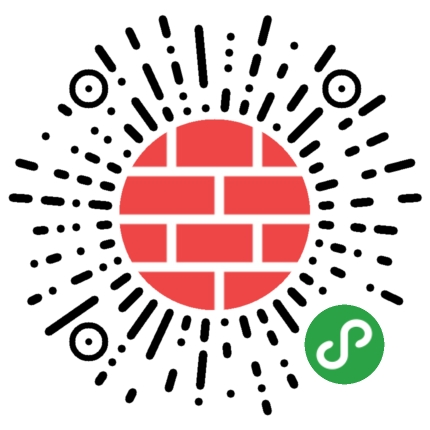
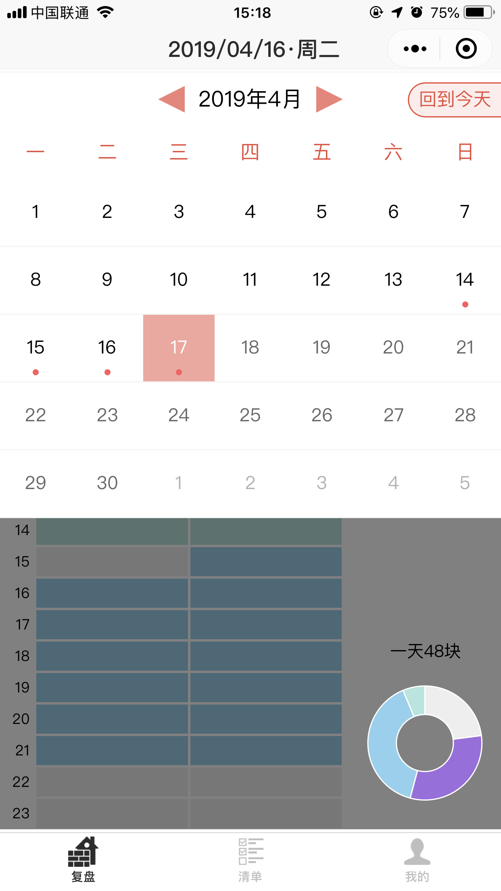

# 微信小程序原生框架日历组件weapp-calendar

## 特点
* 可设置一周的起始日期是周一或周日
* 可初始显示指定的日期
* 可设置截止选择的日期
* 可设置有标红点的日期
* 可更改主题色

## 使用
本仓库是一个简单的日历demo,整个下载并在**微信开发者工具**中打开运行即可查看.

引入自己项目的方式是把`components/navbar`目录复制到你的项目下,并按下面配置.

1. 页面json
```json
  "usingComponents": {
    "calendar":"/components/calendar/calendar"
  }
```

2. 页面wxml
```wxml
  <!--
 * 日历选择组件
 * 属性名                   类型    是否必须   默认值       说明
 * is-calendar-show     [Boolean]   是      false    是否显示日历组件
 * is-insert            [Boolean]   否      fasle    是否开启插入模式,不显示背景遮罩层
 * format               [Boolean]   否      1        一周开始的第一天是周几,0:周日,1:周一
 * target-date          [String]    否      今天      日历开始时显示选择的哪一天,如`2019-03-21`
 * deadline             [String]    否      今天      哪一天之后的日期不可被选择,如`9102-11-11`
 * mark                 [Array]     否      []       那些日期被选中,格式如`['2019-03-20','2019-03-22']`
 * bind:cal-show-toggle [function]  否               日历栏开启或关闭时的响应事件
 * bind:getdate         [function]  否               当前选择的日期的响应事件,`detail`中有选择的日期如`2019-03-21`
  -->
  <calendar
      is-calendar-show="{{isCalendarShow}}"
      mark="{{calendarMark}}"
      format="1"
      bind:getdate="onCalendarGetDate"
  />
```

3. 页面js
```js
//组件依赖的数据
data: {
  isCalendarShow:true,
  calendarMark:['2019-03-21','2019-03-21'],
}
```
```js
  /**
   * 获取选择日期
   */
  onCalendarGetDate(e) {
    console.log(e.detail.selected)
  }
```

4. 主题色
如果打算修改主题色,可以修改`calendar.wxss`文件中下面这一个`color`属性即可
```css
.theme-color {
  /* todo 更换主题颜色*/
  color: #ea4c3c;
}
```

## 线上项目示例
### **砖头时间**


周一开始,红色

周日开始,蓝色


## 注意事项
* 本组件会宽度占满父容器的宽高,高度有部份是遮罩层的占用,请参考本demo调整容器大小,以适应你的项目
* 如果你觉得本组件对你也有用的话请赏个星星呗~

## 参考
特别感谢开源贡献的@mehaotian [wx-calendar](https://github.com/mehaotian/wx-calendar)